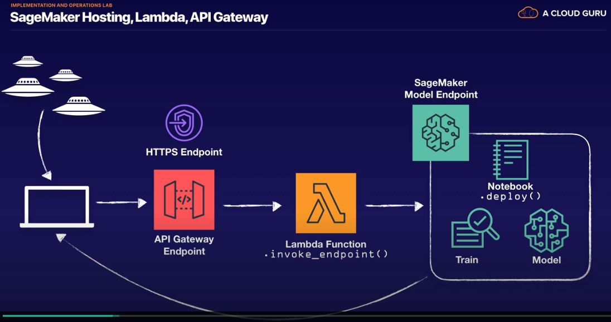

# Problem Statement
Deploy the model to sagemaker 

Create an API Gateway endpoint that invokes a lambda function.
This lambda function calls the .invoke_endpoint() method with 
any new UFO sighting.  Return the results from the models prediction.

### Steps
1. Sagemaker Notebook: retrain the model.  Then call .deploy().  Jupyternotebook
2. Create a lambda function to invoke_endpoint.
<ul>
 <li>Create a new Environment variable (which is needed for the lambda: os.environ['ENDPOINT_NAME']: 
 key = ENDPOINT_NAME 
 value = sagemaker's endpoint name from Sagemaker console  
 <li>lambda IAM role will need to have sagemaker related policy
 </ul> 
3. Create an API gateway to invoke lambda
<ul>
<li>REST API</li>
<li>Create Method: POST </li>
<li>Integration Type: Lambda function </li>
<li>Lambda function: lambda function created in step 2 </li>
</ul>